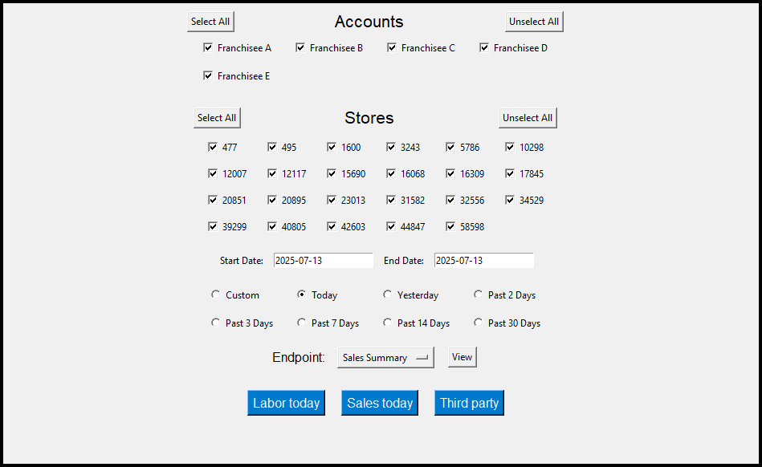
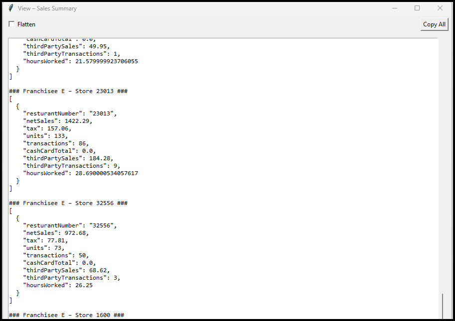
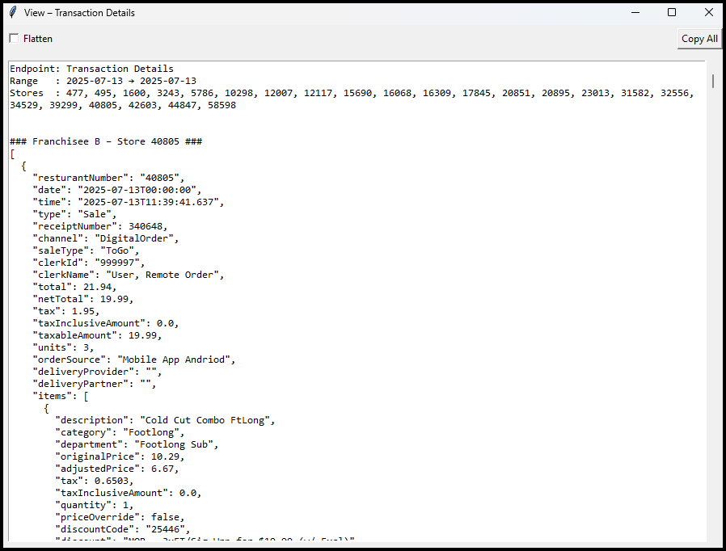
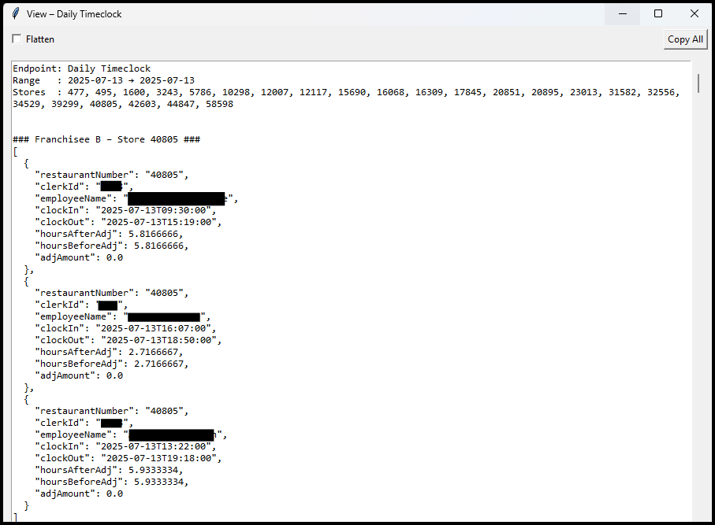

<p align="center">
  <br>
  <b>Subway‑LiveIQ‑Tool</b><br>
  <i>Because spreadsheets are so 2020.</i>
</p>

<p align="center">
  
  
</p>

---

## Table of Contents
1. [Why this exists](#why-this-exists)  
2. [Instant demo](#instant-demo)  
3. [What this app does](#what-this-app-does)  
4. [Quick start](#quick-start)  
5. [Packaging to .exe](#packaging-to-exe)  
6. [Working with `config.json`](#working-with-configjson)  
7. [Folder map](#folder-map)  
8. [Troubleshooting](#troubleshooting)  
9. [LiveIQ API quirks & pitfalls](#liveiq-api-quirks--pitfalls)  
10. [Developing custom modules](#developing-custom-modules)  
11. [Contributing](#contributing)  
12. [License](#license)

---

## Why this exists
Running multiple Subway® stores usually means juggling LiveIQ log-ins and exporting clunky CSVs. **Subway-LiveIQ-Tool** talks straight to the franchisee API, merges every account & store into a single UI, and gives you clean JSON or one-click dashboards.

---

## Screenshots




---

## What this app does
| 🛠 Feature | Detail |
|-----------|--------|
| **Multi-account login** | Reads unlimited `ClientID` / `ClientKEY` pairs from *config.json* and auto-discovers all stores. |
| **Store & account filters** | Checkbox grids with **Select All / Unselect All** for both accounts and stores. |
| **Date presets** | Today · Yesterday · Past N Days (2–30) or custom. |
| **Endpoint picker** | Seven built-in LiveIQ endpoints (add more in code). |
| **Viewer** | Pretty JSON or flattened view + **Copy All** button. |
| **Plug-in system** | Drop a `.py` in **modules/** and it becomes a button. |
| **Error logging** | UTC-stamped `error.log`. |
| **Packaging-ready** | Works as `python LiveIQ-API-Tool.py` or one-file EXE. |

---

## Quick start
```bash
git clone https://github.com/alxl85/Subway-LiveIQ-Tool.git
cd Subway-LiveIQ-Tool
python -m venv .venv && (. .venv/bin/activate || .venv\Scripts\activate)
pip install -r requirements.txt
python LiveIQ-API-Tool.py
```

First launch writes **config.json** and creates an empty **modules/** folder.  
Add credentials (see below) and relaunch.

---

## Packaging to .exe

I have provided a current working version packeged into a standalone .exe but here's how you can download the script and package it yourself.

```powershell
pyinstaller --onefile --noconsole `
  --name "LiveIQ-API-Tool" `
  --icon="screenshots/logo.ico" `
  --add-data "modules;modules" `
  LiveIQ-API-Tool.py
```
> On macOS/Linux swap the semicolon for a colon in `--add-data`.  
> Remove `--noconsole` while debugging to see tracebacks.

---

## Working with `config.json`
```json
{
  "accounts": [
    {
      "Name": "Franchisee A",
      "ClientID": "xxxxxxxx",
      "ClientKEY": "yyyyyyyy"
    }
  ]
}
```
**Location** — same folder as `main.py` / `LiveIQ-API-Tool.exe`.

<details>
<summary><b>How to obtain API keys</b></summary>

1. Log in to Subway Fresh Connect.  
2. **Fresh Connect ▸ Instructions** → **Generate Keys**.  
3. Copy *Client ID* & *Client KEY* into **config.json**.  


</details>

Add one entry per franchisee account; duplicate store numbers are auto‑deduplicated.

---

## Folder map
```text
Subway-LiveIQ-Tool/
├ main.py
├ logo.ico
├ config.json
└ modules/
    ├ daily_sales.py
    └ daily_clockins.py
```
Packaged layout:
```
Release/
│ LiveIQ-API-Tool.exe
│ config.json
└modules/
```

---

## Troubleshooting
| 😖 Symptom | 🩹 Fix |
|------------|-------|
| EXE does nothing | Build **without** `--noconsole`, run from *cmd* to read traceback. |
| No plugin buttons | Ensure **modules/** exists or include it via `--add-data`. |
| Config regenerates every time | Edit the `config.json` next to the EXE, not the Temp copy. |
| Icon refused | Provide a real 256×256, 32‑bit ICO or let Pillow auto‑convert. |

---

## LiveIQ API quirks & pitfalls
| Issue | Impact | Mitigation |
|-------|--------|-----------|
| Undocumented rate-limit (~60 req/min) | 429 errors | ≤10 threads + retry with back-off. |
| 30–60 min data latency | “Today” appears low | Pull after close or warn users. |
| Field drift (`netSale` → `netSales`) | KeyError | Use `.get()` with defaults. |
| Store-local timestamps | Cross‑TZ math off | Convert with `pytz`. |
| Random 500/502 | Module crash | Wrap loops in `try/except`, retry. |

---

## Developing custom modules

This site outlines the entire LiveIQ API schema.
https://app.swaggerhub.com/apis/Subway/freshconnect_liveiq_franchisee_api/v1

Each module is **one file** in **modules/**. The viewer imports it and calls `run(window)`.

<details>
<summary><b>Minimal module example</b></summary>

```python
# modules/my_module.py
def run(win):
    import tkinter as tk, threading, datetime
    from tkinter.scrolledtext import ScrolledText
    from __main__ import fetch_data, store_vars, config_accounts

    txt = ScrolledText(win, font=("Consolas",10))
    txt.pack(expand=True, fill="both")

    chosen = [sid for sid, v in store_vars.items() if v.get()]
    if not chosen:
        txt.insert("end","No stores selected."); return

    def worker():
        today = datetime.date.today().strftime("%Y-%m-%d")
        for acct in config_accounts:
            for sid in acct["StoreIDs"]:
                if sid not in chosen:
                    continue
                data = fetch_data("Sales Summary", sid, today, today,
                                  acct["ClientID"], acct["ClientKEY"])
                net = (data.get("data") or data)[0]["netSales"]
                txt.insert("end", f"{sid}: ${net}\n")

    threading.Thread(target=worker, daemon=True).start()
```
</details>

<details>
<summary><b>Daily Clock-ins example</b></summary>

```python
# modules/daily_clockins.py
import tkinter as tk
from tkinter.scrolledtext import ScrolledText
from datetime import datetime
from concurrent.futures import ThreadPoolExecutor, as_completed

# ---------------------------------------------------------------------------
# Module: daily_clockins.py
# Purpose: Show *all* employees who have clocked‑in today (whether or not they
#          have clocked out yet) for every store currently checked in the host
#          GUI. Results appear in a single scrollable popup.
# ---------------------------------------------------------------------------

ENDPOINT_NAME = "Daily Timeclock"  # key expected in host ENDPOINTS dict


def run(window):
    """Populate widgets inside the provided *window* (Toplevel)."""

    window.title("Clock‑ins – Today")
    window.geometry("600x650")

    txt = ScrolledText(window, wrap="word", font=("Consolas", 11))
    txt.pack(expand=True, fill="both", padx=12, pady=12)

    def log(line: str = ""):
        txt.insert("end", line + "\n")
        txt.see("end")

    # ---- pull globals from host ------------------------------------------
    try:
        from __main__ import fetch_data, store_vars, config_accounts  # type: ignore
    except ImportError:
        log("❌ Required symbols (fetch_data / store_vars / config_accounts) missing.")
        return

    selected = [sid for sid, var in store_vars.items() if var.get()]
    if not selected:
        log("No stores selected in the main window.")
        return

    today = datetime.now().strftime("%Y-%m-%d")
    log(f"Date: {today}")
    log(f"Stores: {', '.join(selected)}")
    log("Fetching Daily Timeclock …\n")

    # ---- concurrent API calls -------------------------------------------
    futures = {}
    with ThreadPoolExecutor(max_workers=10) as ex:
        for acct in config_accounts:
            cid, ckey, acct_name = acct["ClientID"], acct["ClientKEY"], acct["Name"]
            for store_id in acct.get("StoreIDs", []):
                if store_id in selected:
                    fut = ex.submit(
                        fetch_data,
                        ENDPOINT_NAME,
                        store_id,
                        today,
                        today,
                        cid,
                        ckey,
                    )
                    futures[fut] = (acct_name, store_id)

    # ---- collate results -------------------------------------------------
    for fut in as_completed(futures):
        acct_name, store_id = futures[fut]
        result = fut.result()
        if "error" in result:
            log(f"Store {store_id}  (Acct: {acct_name})  →  ERROR: {result['error']}")
            continue

        data = result.get("data", result)
        if isinstance(data, dict):
            data = [data]

        unique = {}
        for rec in data or []:
            name = rec.get("employeeName", "<unknown>")
            clock_in = rec.get("clockInDateTime") or rec.get("clockIn")
            job = rec.get("jobDescription") or rec.get("jobCode", "")
            # keep earliest clock‑in per employee
            if name not in unique or (clock_in and clock_in < unique[name]["clock_in"]):
                unique[name] = {"clock_in": clock_in, "job": job}

        log(f"➤ Store {store_id}  (Acct: {acct_name})")
        if not unique:
            log("   — No clock‑ins recorded today —\n")
            continue
        for emp, meta in sorted(unique.items(), key=lambda x: x[0].lower()):
            log(f"   • {emp}  |  In: {meta['clock_in']}  |  {meta['job']}")
        log()

```
</details>

### Available host helpers
| Helper | Purpose |
|--------|---------|
| `fetch_data()` | Wrapper around LiveIQ request |
| `store_vars` | Dict of checked stores |
| `account_store_map` | Stores per account |
| `config_accounts` | Account config (includes `StoreIDs`) |
| `flatten_json()` | Turn nested JSON into dotted paths |
| `log_error()` | Append to `error.log` |

### Common patterns
| Goal | Snippet |
|------|---------|
| Background thread | `threading.Thread(target=fn, daemon=True).start()` |
| Progress bar | `ttk.Progressbar(window, mode="determinate")` |
| Flatten JSON | `flat = flatten_json(data)` |

### LiveIQ endpoint names
| Dropdown label | `fetch_data` value |
|----------------|--------------------|
| Sales Summary | `"Sales Summary"` |
| Daily Sales Summary | `"Daily Sales Summary"` |
| Daily Timeclock | `"Daily Timeclock"` |
| Third Party Sales Summary | `"Third Party Sales Summary"` |
| Third Party Transaction Summary | `"Third Party Transaction Summary"` |
| Transaction Summary | `"Transaction Summary"` |
| Transaction Details | `"Transaction Details"` |

### Debugging tips
* Run from a terminal (omit `--noconsole`) so `print()` is visible.  
* Wrap risky code with `try/except` and log via `log_error()`.  
* Import heavy libs **inside** `run()`—helps PyInstaller.

---

## Contributing
Pull requests welcome!  

1. Fork → feature branch  
2. `pip install -r requirements-dev.txt`  
3. `pre-commit install`  
4. Open a PR with screenshot/GIF if UI-related.

---

## License
MIT—use it, fork it, just don’t blame us if your sandwich shop catches fire.

> _Built for franchisees who’d rather read numbers than copy‑paste them._
